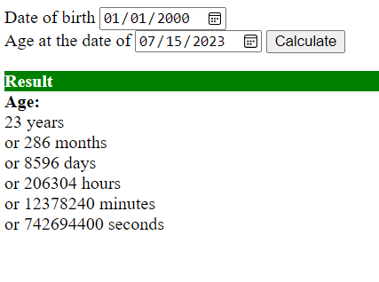

# Age Calculator Web Application

## Tasks

Create a user form to input the date of birth and the date you need the age at then calculate the age in days, hours, minutes and seconds.

## Output

## To Run App

``` bash
mvn install tomcat7:deploy
```

## Used Technologies

- Java: v19
- Jakarta EE: v9.0.0
- Apache Maven: v3.8.7
- Tomcat: 10.1
