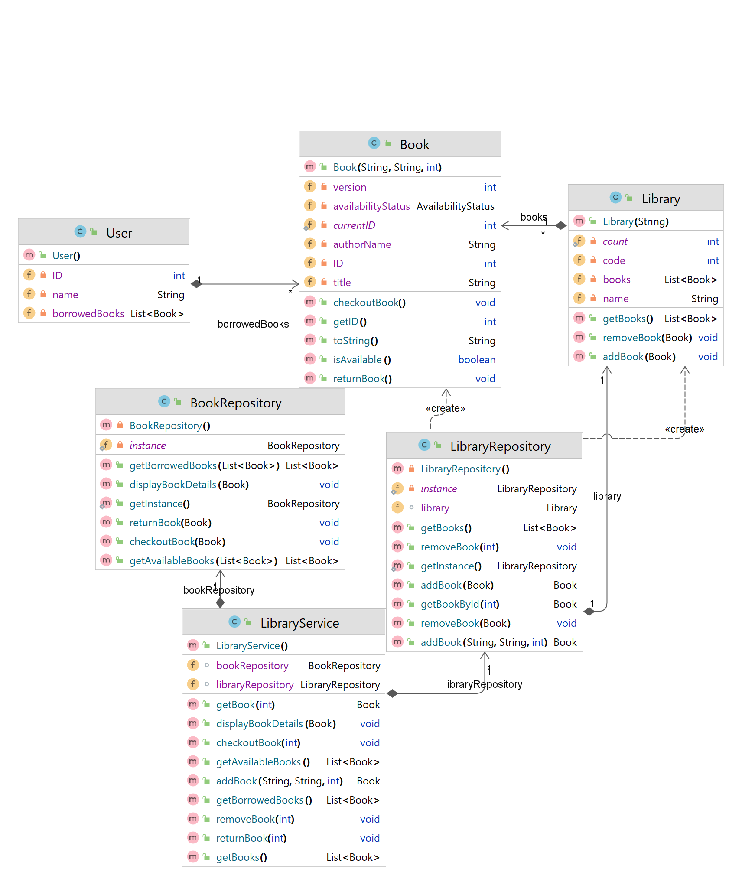

# [Library Management System Project](https://docs.google.com/document/d/1C4DVvBbD4qH1dhXOVDub2hZX_2ns4qAdEC1cLPt9gOg/edit?usp=sharing)

## [App Description (link)](https://docs.google.com/document/d/1C4DVvBbD4qH1dhXOVDub2hZX_2ns4qAdEC1cLPt9gOg/edit?usp=sharing)

<pre>Application for the management of the books in library,  managing checking out of books and the returning by notatitng it in the system.
</pre>

> to run app: **mvn compile exec:java**

# App UML

## Used Technologies

* Java: v19
* Apache Maven: v3.8.7
