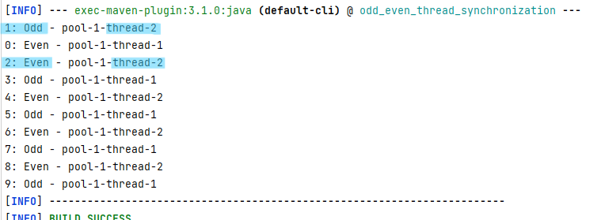

# Thread Synchronization Exercise (odd, even)
## App Description

> This app implements a program where two threads alternate printing odd and even numbers.

## App Output

## To Run App:
> **mvn compile exec:java**

## Used Technologies

* Java: v19
* Apache Maven: v3.8.7