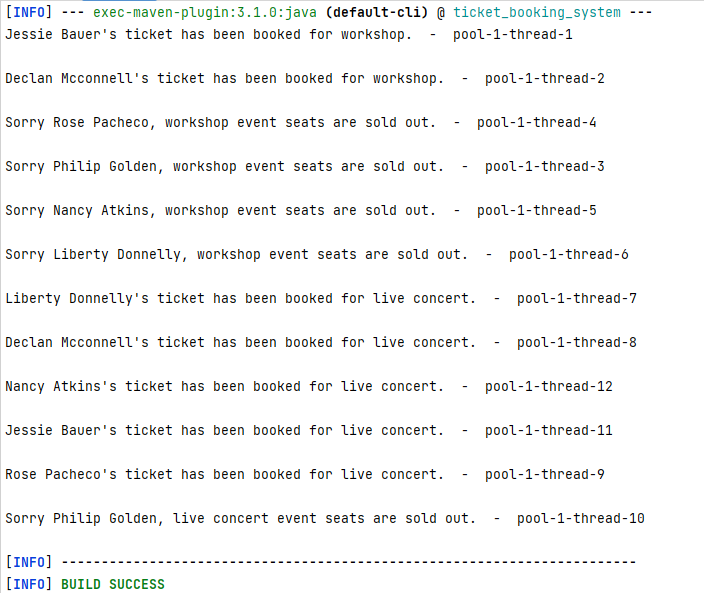

# Multi-Threaded Ticket Booking System
## App Description

> A multithreaded program that simulates a ticket booking system. Create multiple threads representing different users trying to book tickets concurrently.
Ensure that only one user can book a ticket at a time and handle scenarios such as sold-out events or seat availability.
## App Output

## To Run App:
> **mvn compile exec:java**

## Used Technologies

* Java: v19
* Apache Maven: v3.8.7