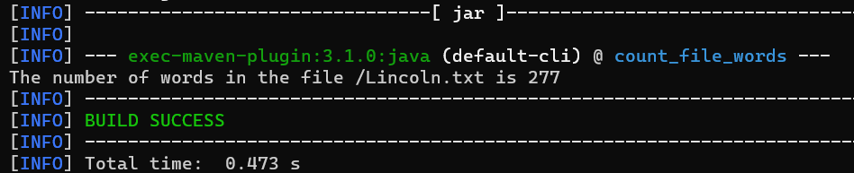

# Count File Words Project
## App Description

```
(Count words) Write a program that counts the number of words in the file
Task instructions:
Make a file named Lincoln.txt
Copy the text on this url and paste it to the file
Print the number of the words inside the file.
```

## App Output



## To Run App:
> **mvn compile exec:java**

## Used Technologies

* Java: v19
* Apache Maven: v3.8.7