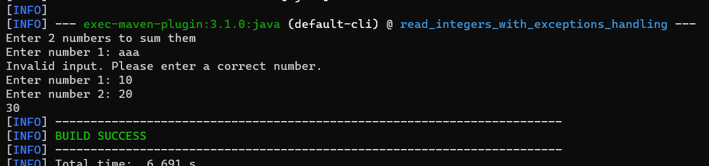

# Read Integers With Exceptions Handling Project
## App Description
```
( InputMismatchException ) Write a program that prompts the user to read
two integers and displays their sum. Your program should prompt the user to
read the number again if the input is incorrect.
```

> to run app: **mvn compile exec:java**
## App Output



## Used Technologies

* Java: v19
* Apache Maven: v3.8.7