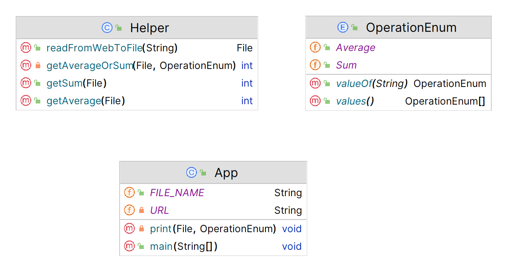

# Calculate the sum and average from a file project
## App Description

```
(Calculate the sum and average from a file) Suppose the text file on the Web
http://liveexample.pearsoncmg.com/data/Scores.txt contains an unspecified number of scores separated by spaces. Write a program that reads the scores from the internet and store them into the file. Then , calculate the sum and average of these values.
Task instructions:
         - Make a file named Scores.txt
         - Read the values in the url and store it inside the file
         - Make a function that reads the values from the file and print the sum and average of the values inside the file.
Code Structure:
         - Make a function(readFromWebToFile) that will take a url and return a file. This method will read the data from the url and store it into the file named Scores.txt
         - Make a function(getSum) that will take a file and return an integer value representing the sum of the values inside the file.
         - Make a function (getAverage) that will take a file and return an integer value representing the average of the values inside the file.
```
## App UML



## App Output


## To Run App:
> **mvn compile exec:java**

## Used Technologies

* Java: v19
* Apache Maven: v3.8.7