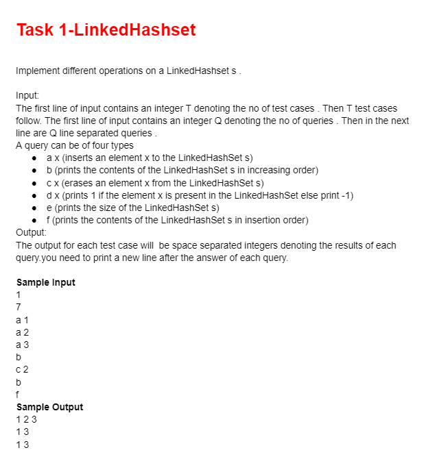
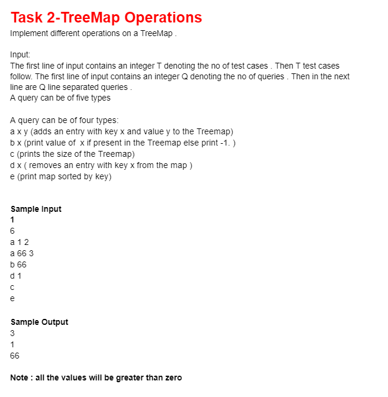
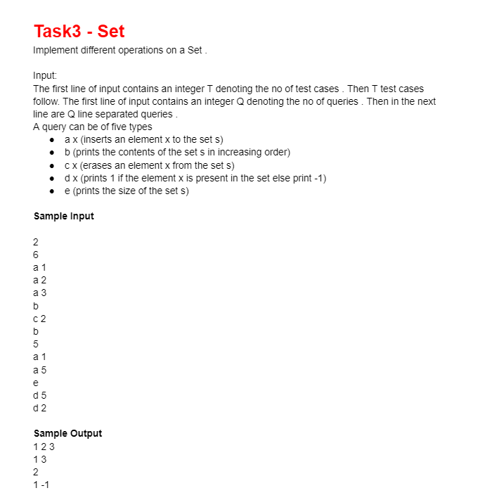
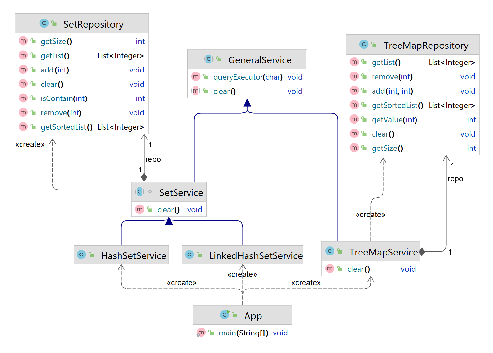
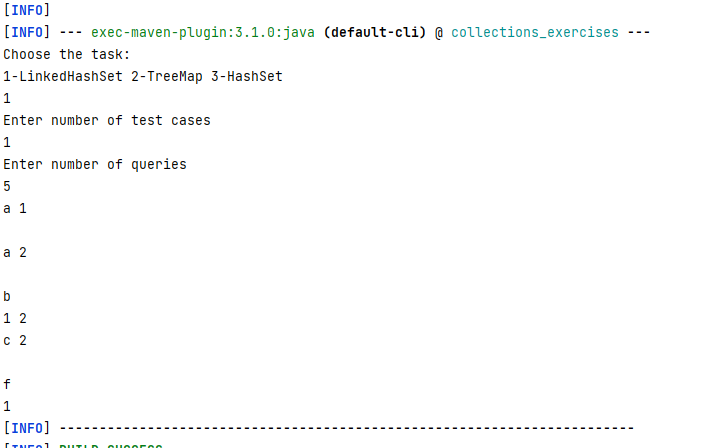

# Collections Exercises
## App Description





```text
This app implements the 3 previous tasks.
```
## App UML



## App Output



## To Run App:
> **mvn compile exec:java**

## Used Technologies

* Java: v19
* Apache Maven: v3.8.7