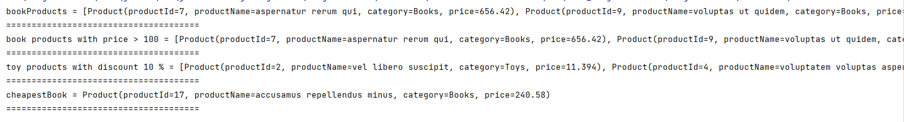

# Product Management With Stream API

## [App Description](https://docs.google.com/document/d/1ZZ1CJI0zgQDSuf1tbGPK6dtzLNiDUU1MUCTP4w_R6Co/edit?usp=sharing)

## Required
1.  Obtain a list of products belongs to category “Books”
2.  Obtain a list of products belongs to category “Books” with price > 100
3.  Obtain a list of product with category = “Toys” and then apply 10% discount
4.  Get the cheapest products of “Books” category

## App Output

## To Run App:
> **mvn compile exec:java**

## Used Technologies

* Java: v19
* Apache Maven: v3.8.7
* Lombok