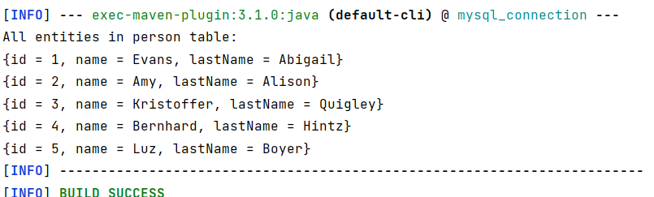

# MySQL Database Connection Application

This Java application demonstrates how to connect to a MySQL database server, execute a query, and print the results with a specific format. The application uses the MySQL Connector/J driver to establish the database connection.

## Tasks

- Install MySQL server and download its driver type 4 (Connector/j).
- Write a java application for connect to a database on MySQL Server and execute a query which selects numbers of fields from a table and print it with any specific format, using load a specific driver and get the connection using DriverManager class.

## App Output



## To Run App

``` bash
mvn compile exec:java
```

## Used Technologies

- Java: v19
- Apache Maven: v3.8.7
- MYSQL 8.0
